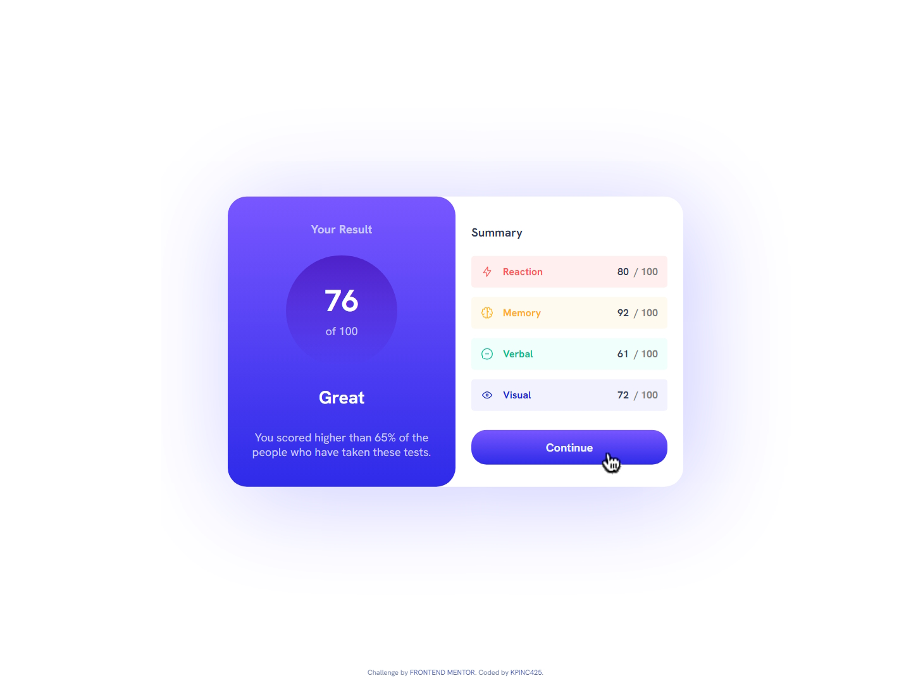

# Frontend Mentor - Results summary component solution

This is a solution to the [Results summary component challenge on Frontend Mentor](https://www.frontendmentor.io/challenges/results-summary-component-CE_K6s0maV). Frontend Mentor challenges help you improve your coding skills by building realistic projects. 

## Table of contents

- [Overview](#overview)
  - [The challenge](#the-challenge)
  - [Screenshot](#screenshot)
  - [Links](#links)
- [My process](#my-process)
  - [Built with](#built-with)
  - [What I learned](#what-i-learned)
  - [Continued development](#continued-development)
  - [Useful resources](#useful-resources)
- [Author](#author)
- [Acknowledgments](#acknowledgments)

## Overview
Used Sass, css modules, vite, and react to build a results summary component, built mobile first, but responsive to many sized screens.
### The challenge

Users should be able to:

- View the optimal layout for the interface depending on their device's screen size
- See hover and focus states for all interactive elements on the page

### Screenshot

### Links

- Solution URL: [Add solution URL here](https://your-solution-url.com)
- Live Site URL: [Add live site URL here](https://kpinc425.github.io/FrontEndMentor-ResultSummary/)

## My process

### Built with

- HTML5
- CSS custom properties
- CSS Modules
- Flexbox
- CSS Grid
- Mobile-first workflow
- [Sass](https://sass-lang.com/) - Sass
- [React](https://reactjs.org/) - JS library
- [Vite](https://vitejs.dev/) - Vite

### What I learned

I expanded on my current Sass adventure by implementing CSS modules using sass. I also used vite for the first time, and it really is blazing fast compilation. I used vite to start a React project as CRA has been pretty much deprecated and I have been looking for a new work flow. I also learned how to pull down a repo from github and install its dependencies and run it locally, this was necessary as I had to switch work stations half way through and my main station had never had vite installed. 

I researched how to use the css module system with sass and vite. Getting everything to work together was a bit of a challenge at first, but the biggest thing is to always check filenames and spelling of most sorts, while I couldn't figure out why the isolation of css styling wasn't happening, it was because I had put name.modules.sass, I just added an s to modules and the whole thing fell apart. I used a mix of inline styling and variable in order to make the badge color dynamic.

### Continued development

I am really enjoying Sass and will likely keep learning more about it in future project and CSS modules will definitely be going into my workflow. I am also going to be using vite for all my future more simple React projects, as it gives me just enough to get started and allows me to grow as needed.

I made a set of "theme" variables in a sass file and used it to set the color variable, this was a fun little experiment and I will likely be doing more of this in the future.

I did have some difficulties getting a corner border working on the result badges and I am still not sure why it didn't work, but I will be looking into that in the future.

### Useful resources

- [Vite](https://vitejs.dev/) - Documentation for vite
- [Sass Doc's](https://sass-lang.com/guide) - Documentation for Sass
- [MDN Doc's](https://developer.mozilla.org/en-US/) - Doc's Doc's and more Doc's
- Stack Overflow - For quick reference with common issues

## Author

- Website - [Coming Soon](https://www.your-site.com)
- Frontend Mentor - [@KPInc425](https://www.frontendmentor.io/profile/KPInc425)

## Acknowledgments

Documentation maintainers, We salute you!

